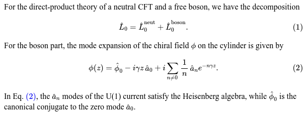

# pandoc-eqref

*pandoc-eqref* is a simple [pandoc][] [filter][] that in effect wraps all `\eqref{...}`
and `\ref{...}` calls in `$...$`, so that they can be recognized and properly
rendered by [MathJax][].

Additionally, it also replaces the [non-breaking space][tilde] `~` in a few
common LaTeX idioms by a simple space `0x20`.

This filter provides a workaround for [jgm/pandoc#1938][1938].

Note: [`pandocfilters`][pf] is embedded here as a git submodule to make it
easier to embed *this* project as a submodule elsewhere.

## Example

Consider for example the following markdown file `example.md`, containing a
"naked" `\eqref{...}` call:

```markdown
For the direct-product theory of a neutral CFT and a free boson, we have the decomposition
\begin{equation}
\hat{L}_0=\hat{L}_0^\text{neut}+\hat{L}_0^\text{boson}.
\end{equation}
For the boson part, the mode expansion of the chiral field $\phi$ on the cylinder is given by
\begin{equation}\label{eq:boson}
\phi(z)=\hat{\phi}_0-i\gamma z\,\hat{a}_0
+i\sum_{n\neq 0}\frac{1}{n}\,\hat{a}_ne^{-n\gamma z}.
\end{equation}

In Eq.~\eqref{eq:boson}, the $\hat{a}_n$ modes of the U(1) current satisfy the Heisenberg algebra, while $\hat{\phi}_0$ is the canonical conjugate to the zero mode $\hat{a}_0$.
```

Converting it to html with the command
```bash
pandoc --standalone --from markdown --to html --mathjax \
    -H autonumber.html --filter ./pandoc-eqref example.md > example.html
```
proper renders `Eq.~\eqref{eq:boson}` into `Eq. (2)`:

<p align="center">
  
</p>

Note that in addition to `--filter ./pandoc-eqref`, here we also include
via `-H` the header file [autonumber.html](autonumber.html) to number all
equations automatically.
[This header is needed][autonumber] to fix [the `(???)` problem][???].


[pandoc]: http://pandoc.org/index.html
[filter]: http://pandoc.org/scripting.html
[MathJax]: https://www.mathjax.org/
[tilde]: https://tex.stackexchange.com/a/41268
[pf]: https://github.com/jgm/pandocfilters
[1938]: https://github.com/jgm/pandoc/issues/1938
[autonumber]: http://docs.mathjax.org/en/latest/tex.html#automatic-equation-numbering
[???]: https://github.com/jgm/pandoc/issues/1938#issuecomment-74011358
